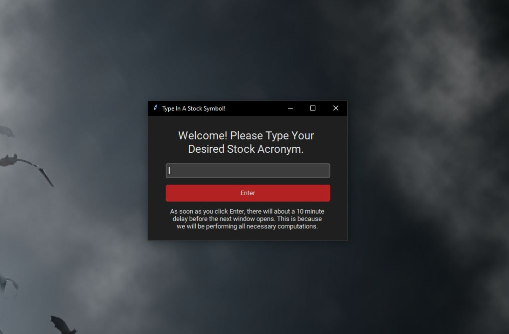
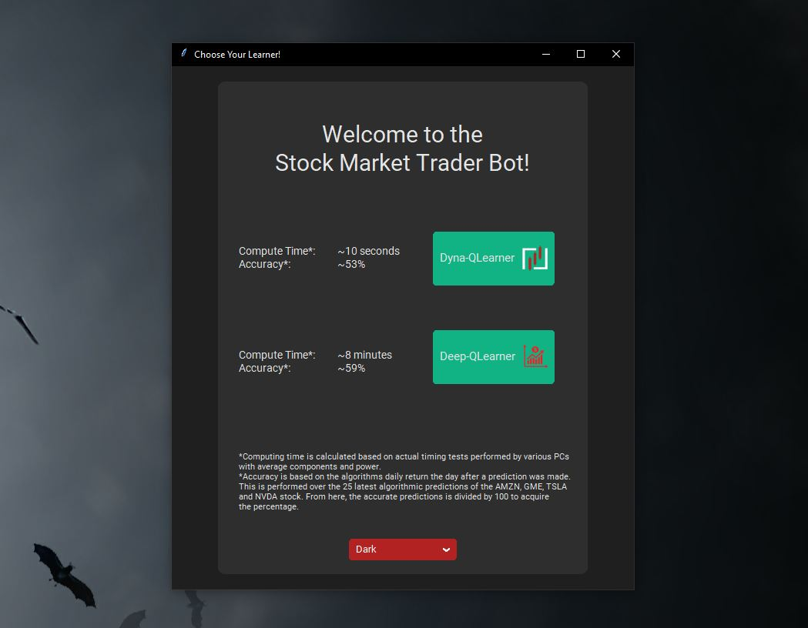
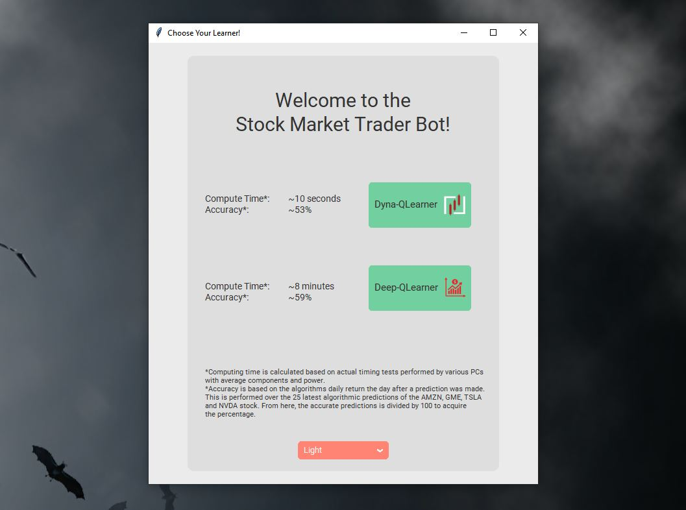
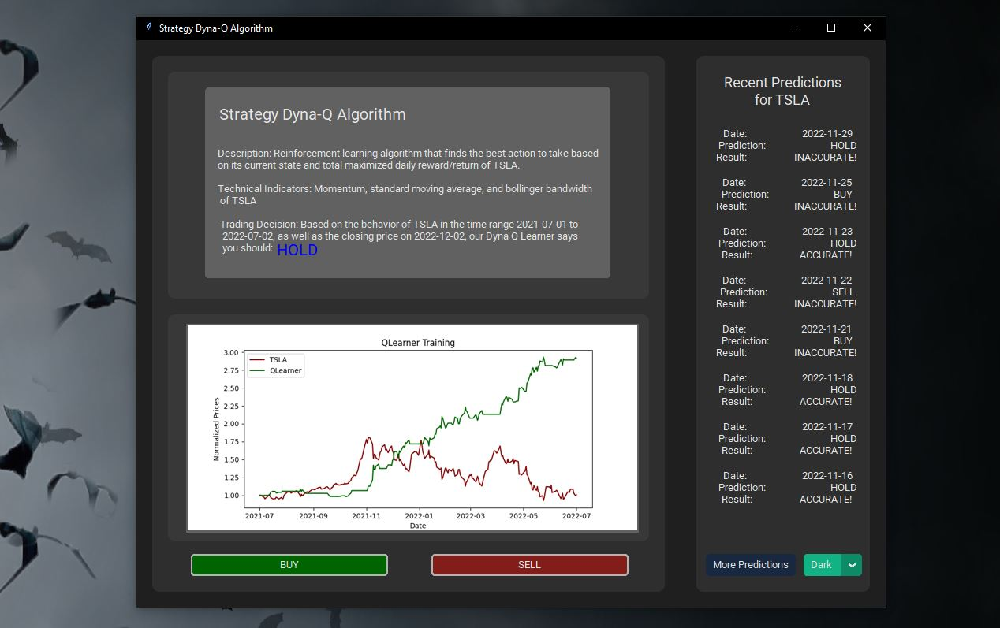
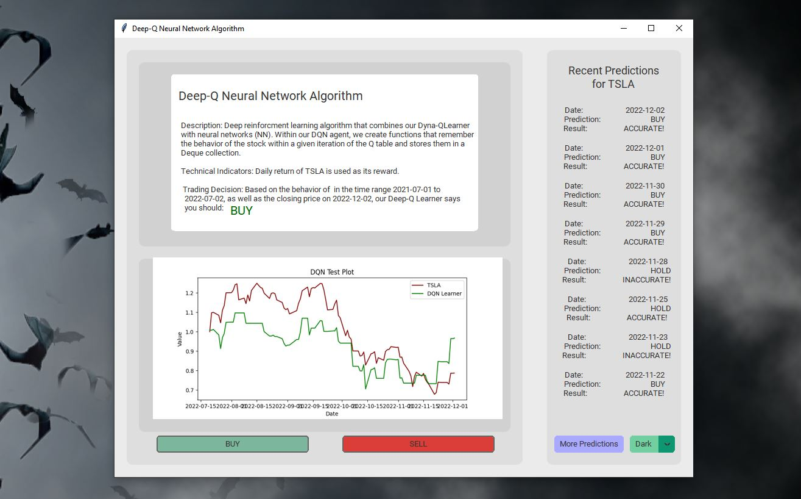

# Table of Contents
---
1. [Installing Dependencies](#Introduction)


## Installing Dependencies <a name="Introduction"></a>
---
1. In order to run this program without errors, all the necessary libraries must be installed as outlined per [Requirements.txt](##Requirements.txt) file. For the easiest installation process: 
   - Open this project in [VS Code](https://code.visualstudio.com/download) and open the terminal by pressing 
``
Ctrl+Shift+`
``.
   - Then, install the dependecies with pip and the terminal using:
  
     ```
     pip3 install -r Requirements.txt
     ```
<br>

## Running the Project
---
1. Once all dependencies have been installed, you are ready to run the project.
    - **Using VS Code:** Navigate to the project's [RunMe.py](##RunMe.py) file, and run the file. 
        
        **NOTE:** There will be a 5 to 10 minute delay after you type your stock in the first window in order to train and test the algorithms.
        <br>

        ### First Pop-Up Window
        ---
        - Contains entry box for user to input stock. Once typed, and enter is selected, algorithms will begin computing.
  
          
          
          <br>

        ### Second Pop-Up Window
        ---
        - Here, you can select which algorithm you would like to see the prediction for.
        
            **Dark Mode**
          
            <br>

            **Light Mode**
          

          <br>

        ### Algorithmic Predictions Windows
        ---
        - Lastly, you can now access all the information relevant to the learner you selected.

            **Dyna-Q Algorithm (Dark Mode)**
          
            <br>
 
            **Deep-Q Algorithm (Light Mode)**
            


## Other Functionalities
### Implementing More Buttons
---
1. The user interface has two buttons after selecting the learner: BUY and SELL. Currently, this project as is does not incorporate BUY and SELL of the stock you inputted in the fist pop-up window.

    - If you **do not** wish to use the BUY and SELL buttons functionality, skip to the [next section](). Otherwise, follow these instructions:
    
        **Step One:** Install [Trader WorkStation (TWS) API](https://www.interactivebrokers.com/en/trading/tws.php#tws-software).
        
        **Step Two:** Create an [InteractiveBrokers account](https://gdcdyn.interactivebrokers.com/Universal/Application) and ensure a funded account.

        **Step Three:** Un-comment out lines [562-564](), [568-570](), [951-953](), and [957-959]() of [UserInterface.py](##UserInterface.py).